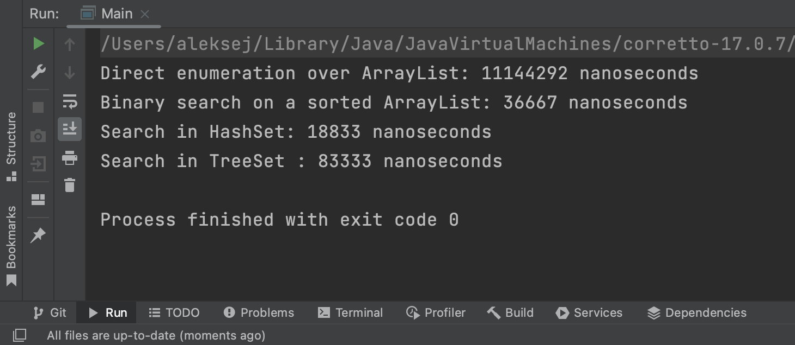

# CollectionsSearch

This code generates over 2 million beautiful Russian license plates and adds to the collection.

Next, the program looks for the number "A999AA11" and measures the time for each search.

